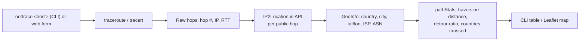

# NetTrace

**Traceroute, visualized on a map — powered by the [IP2Location.io](https://www.ip2location.io) API.**

Running `traceroute` tells you *which* routers your packets bounced through. It doesn't tell you *where* those routers physically are, who operates them, or how indirect your packets' actual path was compared to a straight line to the destination. NetTrace fills that gap: it runs a real traceroute (or a bundled demo path), geolocates every public hop with IP2Location.io, and draws the whole route on an interactive map — plus a "detour ratio" showing how much longer the routed path is than the direct great-circle distance.

## What it looks like

Run `npm start`, open `http://localhost:3000`, type a target, and you get:
- A dark, Leaflet-based world map with a marker per hop and a line connecting them in order
- A hop-by-hop list with IP, city/country, ISP, and round-trip time
- Summary stats: routed distance, direct distance, detour ratio, and the list of countries your packets passed through

There's also a plain terminal CLI (`nettrace <host>`) if you don't want the web UI, and the core is usable as a plain Node library.

## How it works



Private/reserved hop IPs (your router, your ISP's CGNAT gateway, etc.) are detected and skipped before ever calling the API, since IP2Location.io can't geolocate non-routable addresses anyway.

## What it uses from the IP2Location.io API

| Field | Used for |
|---|---|
| `latitude`, `longitude` | Plotting each hop on the map; haversine distance between hops |
| `country_name`, `region_name`, `city_name` | Human-readable location labels, "countries crossed" summary |
| `isp`, `asn`, `as` | Showing which network operator owns each hop |
| `is_proxy` | Flagging hops that are themselves proxy/hosting infrastructure |

## Project layout

```
src/
  traceroute.js     runs traceroute/tracert, parses stdout into hops (pure parsers are unit-testable)
  geolocate.js       IP2Location.io client: caching, private-IP short-circuit, error handling
  geo.js              haversine distance + route-efficiency ("detour ratio") stats
  demoData.js         bundled fallback hop list for environments where traceroute is blocked
  trace.js             orchestrates the three above; used by both the CLI and the server

server/
  app.js              Express app factory (dependency-injectable, for testing)
  index.js             real entry point (npm start)

public/                Leaflet-based web UI (index.html, style.css, app.js)
bin/nettrace.js        CLI entry point
examples/quickstart.js library usage with no CLI or server
test/                  node:test suite, fully mocked — no API key or working traceroute required
```

## Setup

Requires Node.js 18+ (for built-in `fetch`; developed and tested on Node 22).

```bash
git clone stevengil-dev/nettrace
cd nettrace
npm install
```

Get a free API key at **https://www.ip2location.io/sign-up**, then export it (or copy `.env.example` to `.env` and load it however your shell prefers):

```bash
export IP2LOCATION_API_KEY=your_api_key_here
```

**This step is optional.** IP2Location.io can be queried with no API key at all, for up to 1,000 lookups/day — NetTrace falls back to this automatically if `IP2LOCATION_API_KEY` isn't set, so `npm start` works immediately with zero signup. Setting a free key just raises the limit to 50,000 lookups/month, at no cost.

Real traceroute needs the OS tool installed:
- **Linux**: `sudo apt install traceroute` (Debian/Ubuntu) or your distro's equivalent
- **macOS**: `traceroute` ships preinstalled
- **Windows**: `tracert` ships preinstalled

If traceroute/ICMP is blocked in your environment (common in containers, CI, sandboxes, and some corporate networks), use **demo mode** — see below — which still performs real IP2Location.io lookups, it just skips running traceroute itself.

## Run the web app

```bash
npm start
```

Open **http://localhost:3000**. Try:
1. A real hostname (e.g. `github.com`) with demo mode unchecked — runs an actual traceroute.
2. If that fails (no traceroute installed, or the network blocks it), check **Demo mode** and run again — it geolocates a fixed, illustrative multi-hop path via the live API so you can still see the map and stats working end to end.

## Run the CLI

```bash
node bin/nettrace.js github.com
node bin/nettrace.js --demo
node bin/nettrace.js github.com --json     # raw JSON instead of a table
node bin/nettrace.js github.com --max-hops 15
```

Example output:

```
Trace to (demo data)

#  IP               Location                      ISP                   RTT
-------------------------------------------------------------------------------------
1  192.168.1.1      private network                                     1.2 ms
2  100.100.100.1    private network                                     8.5 ms
3  1.1.1.1          Sydney, Australia             Cloudflare            15.3 ms
4  9.9.9.9          Berkeley, United States       Quad9                 40.2 ms
5  * * *            no response
6  8.8.8.8          Mountain View, United States  Google                62.4 ms
7  208.67.222.222   San Francisco, United States  OpenDNS               70.1 ms
8  8.8.4.4          Mountain View, United States  Google                85.6 ms

-------------------------------------------------------------------------------------
Routed distance: 12121.1 km   Direct distance: 11953.2 km   Detour ratio: 1.01x
Countries crossed: Australia -> United States
```

## Use it as a library

```js
const { trace } = require('./src/trace');
const { IP2LocationClient } = require('./src/geolocate');

const geoClient = new IP2LocationClient(); // reads IP2LOCATION_API_KEY
const result = await trace('example.com', { geoClient });

console.log(result.stats.detourRatio, result.hops);
```

See `examples/quickstart.js` for a runnable version.

## Testing

The full suite runs offline against mocked traceroute output and mocked `fetch` — no API key, no working traceroute binary, and no network access required:

```bash
npm test
```

## License

MIT — see [LICENSE](LICENSE).
